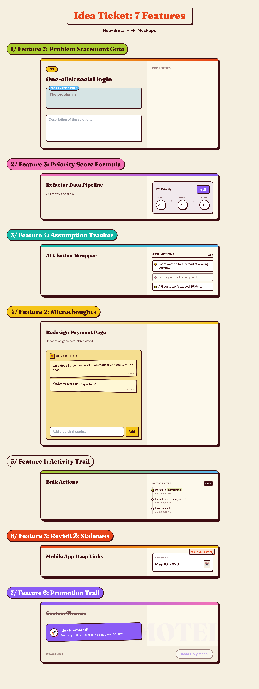

# Overview
This design explores integrating 7 new features seamlessly into the existing "Idea Ticket" modal while strictly adhering to the neo-brutal design system. The goal is to provide rich idea-management capabilities without overwhelming the user with a cluttered UX.

# Design Hypothesis
If we structure new properties into distinct, highly interactive "widgets" (like priority math dials, analog scratchpads, and traffic-light assumptions), users will be more likely to maintain idea hygiene than if they were presented with a generic list of standard form fields. Visual chunking reduces perceived effort.

# Screenshots

# Key Design Decisions

1. **Feature 7 - Problem Statement Gate:** Elevated above the main description with strong blue visual weight to anchor the feature to a user pain point before allowing execution details to take over the mental model.
2. **Feature 3 - ICE Formula Dials:** Replaced standard dropdowns with interactive "math dials". Presenting prioritization as a mathematical equation (`Impact / Effort * Conf`) removes emotional attachment to bad ideas.
3. **Feature 4 - Assumption Tracker List:** Used simple traffic-light dots for tested/untested/invalidated states. It forces builders to confront untested leaps of faith explicitly without cluttering the UI with heavy dropdowns.
4. **Feature 2 - Sticky Note Scratchpad:** Styled the microthoughts with a slight rotation and distinct background color to mimic messy analog reality. This encourages raw, unpolished brain-dumps that don't pollute the main spec.
5. **Feature 6 - Promotion Trail:** The promotion banner is unapologetically celebratory (rotated, purple accent, bold icon) to provide a dopamine hit for shipping an idea to the dev backlog.

# Component Breakdown
* **Card Base (`modal-base`)**: Shared wrapper component that dictates the two-column grid.
* **Form Block (`input-brutal`)**: Universal neo-brutal input class ensuring focus shadows pop.
* **Badges/Pills (`pill`, `shadow-brutal-sm`)**: Used for stats, statuses, and tags.

# Open Questions
1. The **Activity Trail** takes up vertical space on the right column. If it grows to 50+ items over months, should we hide it behind a "View History" toggle, or automatically truncate and scroll it inline?
