# UI/UX Improvement Plan — Kanban Board MCP

## 1. Executive Summary

This document consolidates the comprehensive audit of the Kanban Board MCP interface. The current UI, while functional, suffers from several core issues that impede user experience and professional perception.

### Core Problems
- **UX Unfriendly:** Critical information (estimates, IDs) is unreadable due to contrast issues; navigation is non-obvious in collapsed states.
- **Theme Inconsistency:** Mixed color palettes (brand vs. Tailwind), inconsistent icon systems (emoji vs. Unicode), and unstyled browser defaults.
- **Unprofessional:** Leftover localization artifacts ("Không làm"), aggressive typography, and lack of standard interactive feedback.
- **AI-Feel:** Standard "generated" traits such as uniform typeface, "prototypey" emoji icons, and lack of visual loading indicators (skeletons).

### Scope & Severity
- **Total Issues:** 25
- **Severity Breakdown:**
  - **Critical:** 3
  - **High:** 9
  - **Medium:** 10
  - **Low:** 3

---

## 2. Issue Catalog

### [ISSUE-01] Estimate Badge Is Invisible on the Ticket Card
- **Severity:** Critical | **Category:** Professionalism
- **Screenshot:** [board-populated.png](./screenshots/board-populated.png)
  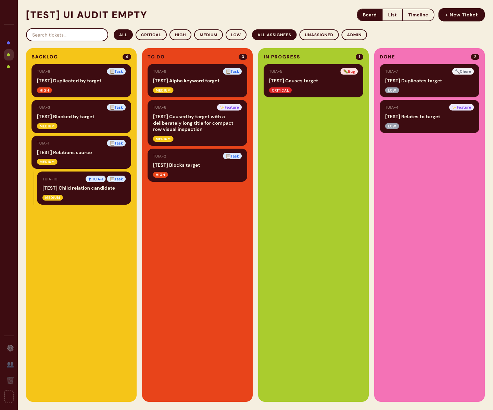
- **Problem:** Badge uses `var(--color-dark)` background on a matching dark card surface.
- **Technical Solution:** Invert colors to high-contrast beige or translucent highlight in `TicketCard.module.css`.

### [ISSUE-02] Low-Contrast Gray Text on Dark Cards
- **Severity:** Critical | **Category:** Professionalism, UX
- **Screenshot:** [ticket-card-hover.png](./screenshots/ticket-card-hover.png)
  
- **Problem:** Due dates and IDs use Gray-500 (#6B7280), failing WCAG contrast requirements.
- **Technical Solution:** Update `TicketCard.module.css` to use high-contrast beige tints (`rgba(245, 239, 224, 0.65)`).

### [ISSUE-03] Mixed Language — "Không làm" in English UI
- **Severity:** Critical | **Category:** Professionalism
- **Screenshot:** [ticket-detail-open.png](./screenshots/ticket-detail-open.png)
  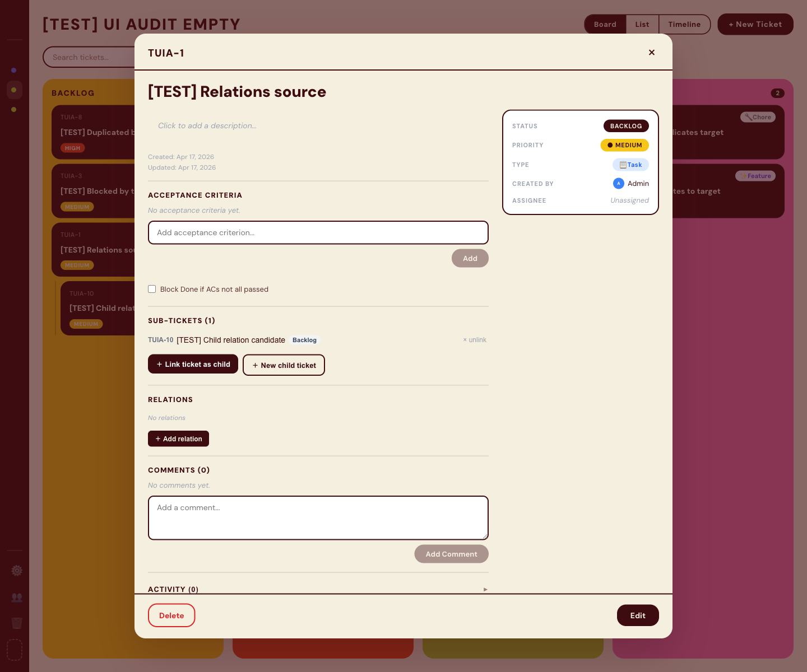
- **Problem:** `wont_do` status label is hardcoded in Vietnamese.
- **Technical Solution:** Update `STATUS_LABELS` in `TicketModal.tsx` to "Won't Do".

### [ISSUE-04] Hover State Makes Cards More Transparent
- **Severity:** High | **Category:** UX, Professionalism
- **Screenshot:** [ticket-card-hover.png](./screenshots/ticket-card-hover.png)
  
- **Problem:** `opacity: 0.92` on hover creates a "fading" effect rather than an activation signal.
- **Technical Solution:** Remove opacity reduction; add box-shadow and increased `translateY` lift in `TicketCard.module.css`.

### [ISSUE-05] Collapsed Sidebar Has No Icons
- **Severity:** High | **Category:** UX, Professionalism
- **Screenshot:** [board-empty.png](./screenshots/board-empty.png)
  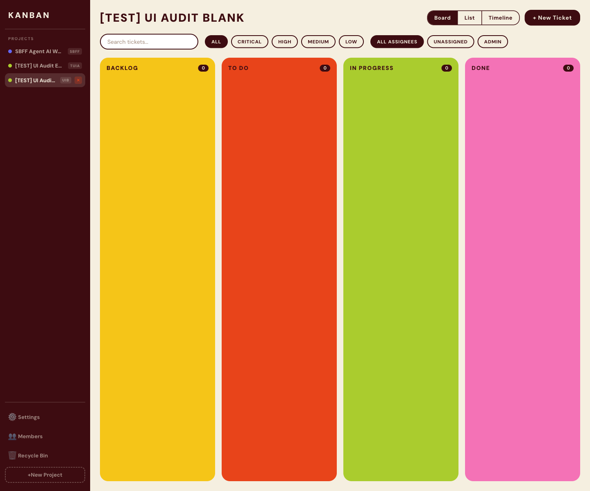
- **Problem:** Action items (Members, Settings) are text-only and hidden when narrow.
- **Design:** [board-layout-redesign.excalidraw](./designs/board-layout-redesign.excalidraw)
  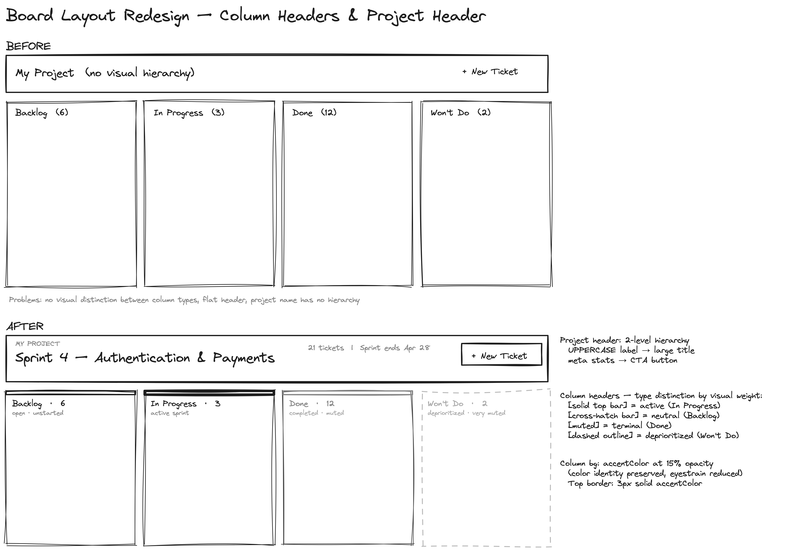
- **Technical Solution:** Implement SVG icon system in `ProjectSidebar.tsx`; show icons always, labels only on expand.

### [ISSUE-06] Search Input Uses Pure White Background
- **Severity:** High | **Category:** Consistency
- **Screenshot:** [board-search-filter.png](./screenshots/board-search-filter.png)
  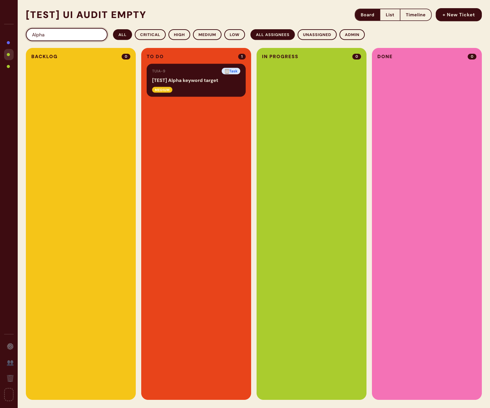
- **Problem:** Jarring white box against warm beige theme.
- **Technical Solution:** Set background to `var(--color-bg)` in `FilterBar.module.css`.

### [ISSUE-07] Native `window.confirm()` for Deletion
- **Severity:** High | **Category:** Professionalism, Consistency
- **Screenshot:** [ticket-delete-confirmation.png](./screenshots/ticket-delete-confirmation.png)
  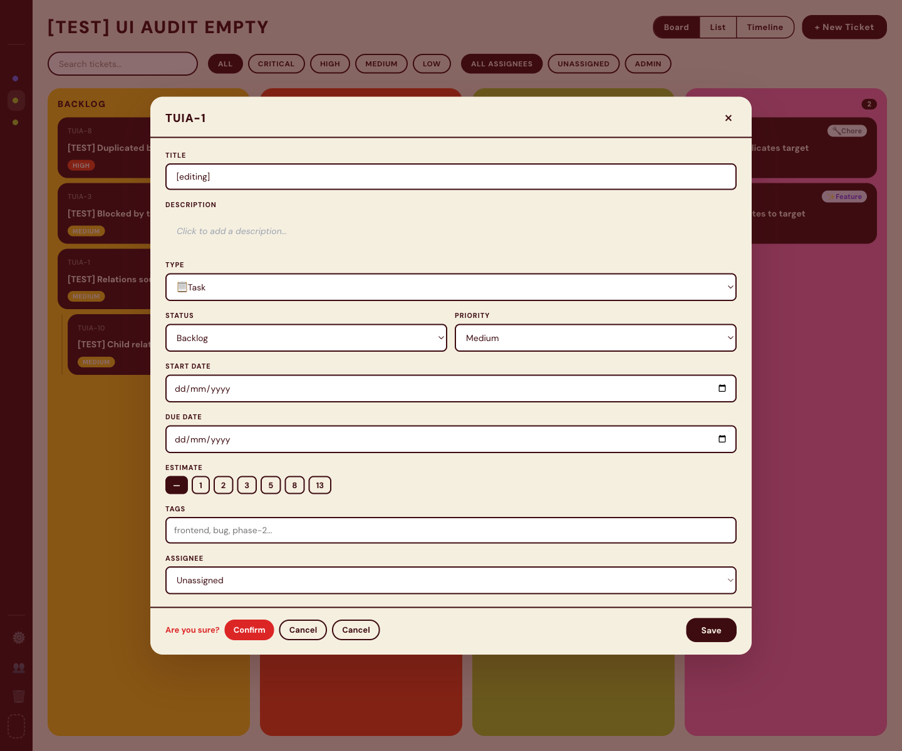
- **Problem:** Browser-native dialog breaks app immersion and design language.
- **Technical Solution:** Create a custom `ConfirmDialog` React component matching the `TicketModal` design.

### [ISSUE-08] No Explicit Drag Handle
- **Severity:** High | **Category:** UX
- **Screenshot:** [board-dragging.png](./screenshots/board-dragging.png)
  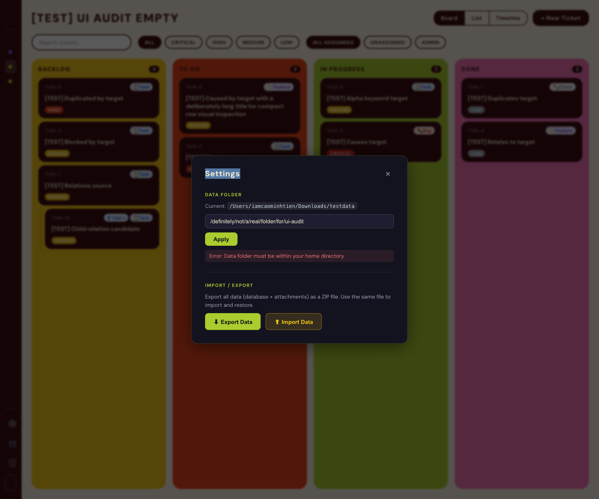
- **Problem:** No visual indicator for "grabbable" surface beyond cursor change.
- **Design:** [interaction-states.excalidraw](./designs/interaction-states.excalidraw)
  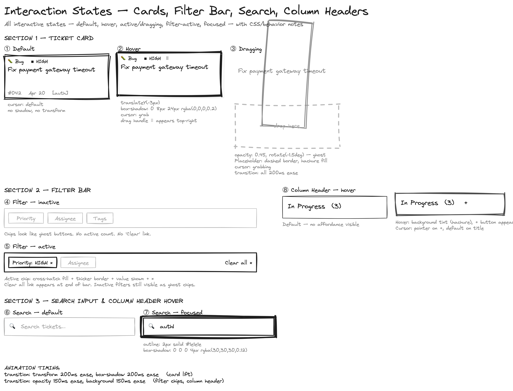
- **Technical Solution:** Add a "grip" icon (`⠿`) or standard `cursor: grab` feedback in `TicketCard.tsx`.

### [ISSUE-09] Pervasive Emoji Icons
- **Severity:** High | **Category:** AI-feel, Professionalism
- **Screenshot:** [board-populated.png](./screenshots/board-populated.png)
  
- **Problem:** Unpredictable emoji rendering looks prototypey and inconsistent.
- **Technical Solution:** Replace emojis with SVG icons (e.g., Lucide Icons) in `TicketCard` and `TicketModal`.

### [ISSUE-10] No Responsive Board Layout
- **Severity:** High | **Category:** UX, Professionalism
- **Screenshot:** [board-mobile-narrow.png](./screenshots/board-mobile-narrow.png)
  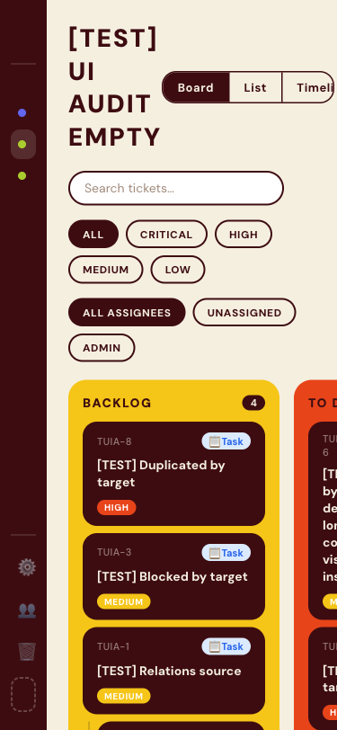
- **Problem:** Grid forces 4 columns on mobile, leading to horizontal scroll.
- **Design:** [mobile-layout-redesign.excalidraw](./designs/mobile-layout-redesign.excalidraw)
  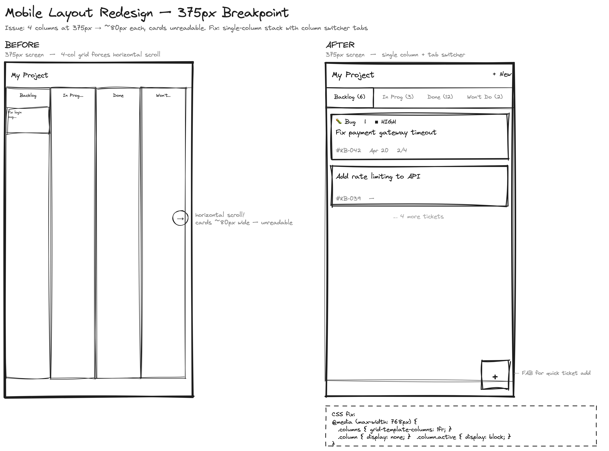
- **Technical Solution:** Update `Board.module.css` with media queries to stack columns vertically on mobile.

### [ISSUE-11] Identical Display/Body Fonts
- **Severity:** Medium | **Category:** AI-feel, Professionalism
- **Screenshot:** [board-populated.png](./screenshots/board-populated.png)
  
- **Problem:** DM Sans for both display and body removes typographic hierarchy.
- **Technical Solution:** Import a serif or high-contrast sans face for `h1`, `h2`, and column headers in `index.css`.

### [ISSUE-12] Off-Brand Colors in RelationsSection
- **Severity:** Medium | **Category:** Consistency, AI-feel
- **Screenshot:** [ticket-relations-add-menu.png](./screenshots/ticket-relations-add-menu.png)
  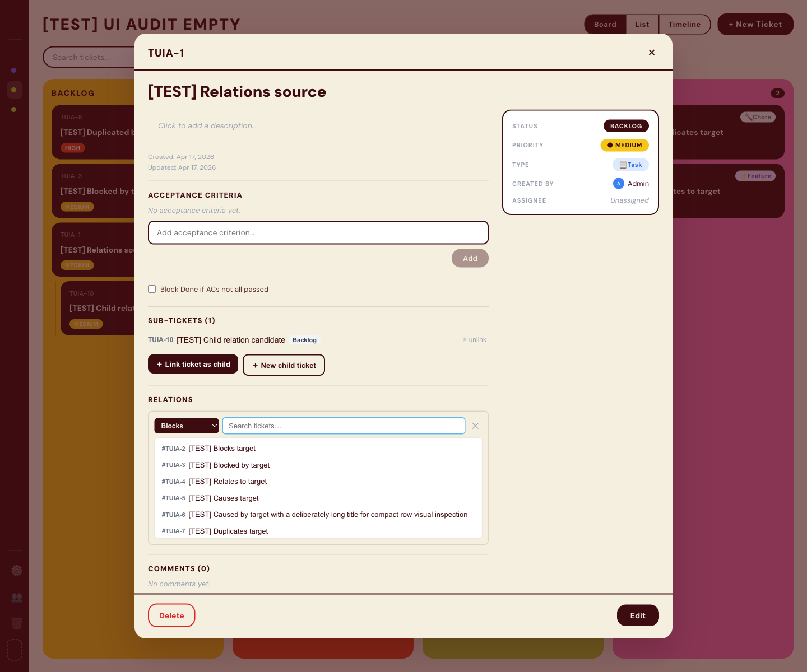
- **Problem:** Uses recognizable Tailwind pastel hex codes instead of brand palette.
- **Technical Solution:** Update `STATUS_COLORS` in `RelationsSection.tsx` to use opacity-adjusted brand tokens.

### [ISSUE-13] Duplicate Priority Color Definitions
- **Severity:** Medium | **Category:** Consistency
- **Screenshot:** [ticket-detail-open.png](./screenshots/ticket-detail-open.png)
  
- **Problem:** Drifting color definitions across `TicketCard` and `TicketModal`.
- **Technical Solution:** Extract priority configuration into a centralized `constants/priority.ts`.

### [ISSUE-14] Column Accent Colors are Overwhelming
- **Severity:** Medium | **Category:** Professionalism, UX
- **Screenshot:** [board-populated.png](./screenshots/board-populated.png)
  
- **Problem:** High-saturation backgrounds create visual noise and bleed around cards.
- **Technical Solution:** Reduce column background opacity to ~15%; add a solid top-border accent.

### [ISSUE-15] Disorganized FilterBar Layout
- **Severity:** Medium | **Category:** UX, Professionalism
- **Screenshot:** [board-search-filter.png](./screenshots/board-search-filter.png)
  
- **Problem:** Multi-row filters lack visual grouping and labels.
- **Technical Solution:** Restructure `FilterBar.tsx` into labeled filter groups with subtle dividers.

### [ISSUE-16] No Onboarding for Empty Board
- **Severity:** Medium | **Category:** UX, Professionalism
- **Screenshot:** [board-empty.png](./screenshots/board-empty.png)
  
- **Problem:** Empty columns give no direction to new users.
- **Design:** [empty-states-redesign.excalidraw](./designs/empty-states-redesign.excalidraw)
  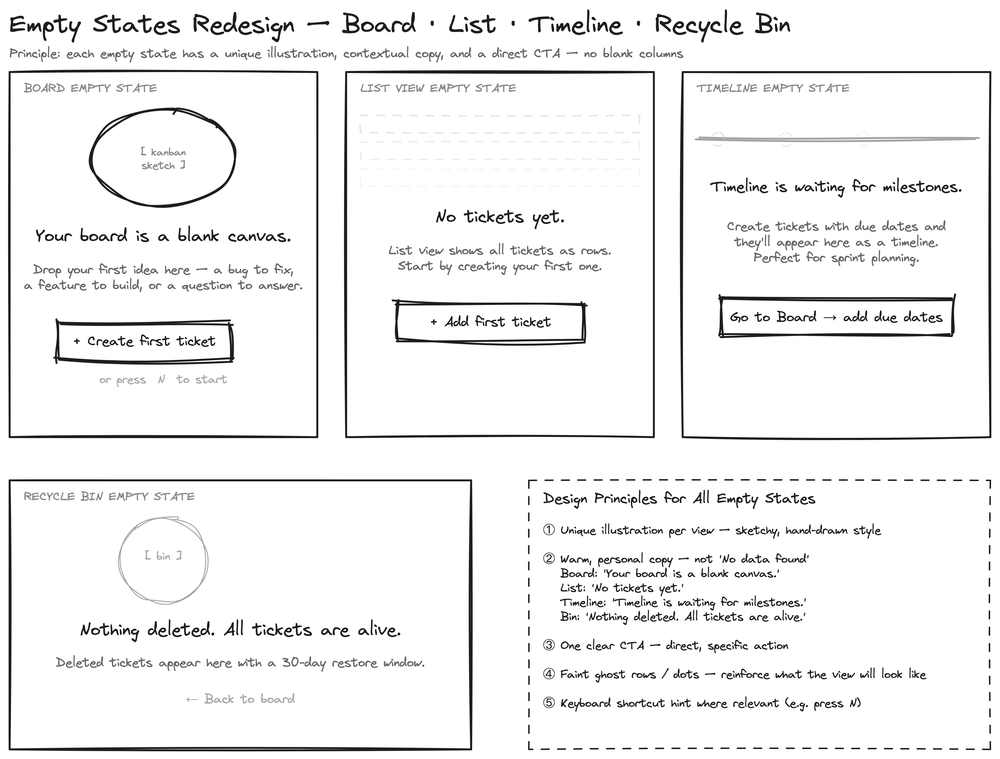
- **Technical Solution:** Render a dedicated "Empty Board" callout in the first column when zero tickets exist.

### [ISSUE-17] Inconsistent Close Button Characters
- **Severity:** Low | **Category:** Consistency, Professionalism
- **Screenshot:** [ticket-relations-add-menu.png](./screenshots/ticket-relations-add-menu.png)
  
- **Problem:** Mixed usage of `×` (multiplication) and `✕` (ballot x).
- **Technical Solution:** Standardize on Lucide SVG `<X />` icon system project-wide.

### [ISSUE-18] Ambiguous Drop Zone Feedback
- **Severity:** Medium | **Category:** UX
- **Screenshot:** [board-dragging.png](./screenshots/board-dragging.png)
  
- **Problem:** Subtle brightness shift is insufficient for drag-drop confidence.
- **Design:** [interaction-states.excalidraw](./designs/interaction-states.excalidraw)
  
- **Technical Solution:** Implement a ghost slot (placeholder) and border-highlighting in `Column.tsx`.

### [ISSUE-19] Missing Sidebar Tooltips
- **Severity:** High | **Category:** UX
- **Screenshot:** [settings-panel.png](./screenshots/settings-panel.png)
  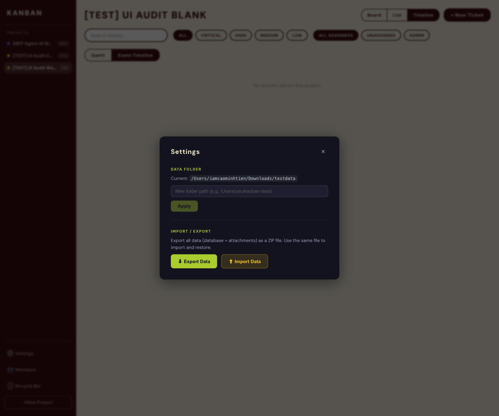
- **Problem:** Collapsed sidebar utility items are undifferentiated and undiscoverable.
- **Technical Solution:** Add `title` tooltips and persistent icons to `ProjectSidebar.tsx`.

### [ISSUE-20] Aggressive Board Title Typography
- **Severity:** Medium | **Category:** AI-feel, Professionalism
- **Screenshot:** [board-populated.png](./screenshots/board-populated.png)
  
- **Problem:** Header uses max weight + wrap-aggressive uppercase treatment.
- **Technical Solution:** Soften letter-spacing and weight; implement ellipsis for long project names.

### [ISSUE-21] Lack of Keyboard Navigation/Focus Trap
- **Severity:** High | **Category:** UX, Professionalism
- **Screenshot:** [ticket-detail-open.png](./screenshots/ticket-detail-open.png)
  
- **Problem:** Modals don't capture focus or handle Escape/Tab keys correctly.
- **Technical Solution:** Implement `focus-trap-react` or native `<dialog>` in `TicketModal` and `SettingsPanel`.

### [ISSUE-22] Inconsistent Filter Active States
- **Severity:** Medium | **Category:** Consistency, UX
- **Screenshot:** [board-search-filter.png](./screenshots/board-search-filter.png)
  
- **Problem:** Priority chips vs. Member chips use different "Selected" visual languages.
- **Technical Solution:** Standardize on dark-fill selection with color-coded border pips for members.

### [ISSUE-23] Invisible Loading States
- **Severity:** Medium | **Category:** UX, Professionalism
- **Screenshot:** N/A (Flash of empty content)
- **Problem:** No skeletons during data fetch; app feels frozen.
- **Technical Solution:** Create `SkeletonCard` component for use during `ticketsLoading`.

### [ISSUE-24] Missing Character Limits/Counters
- **Severity:** Low | **Category:** UX, Professionalism
- **Screenshot:** [ticket-detail-editing.png](./screenshots/ticket-detail-editing.png)
  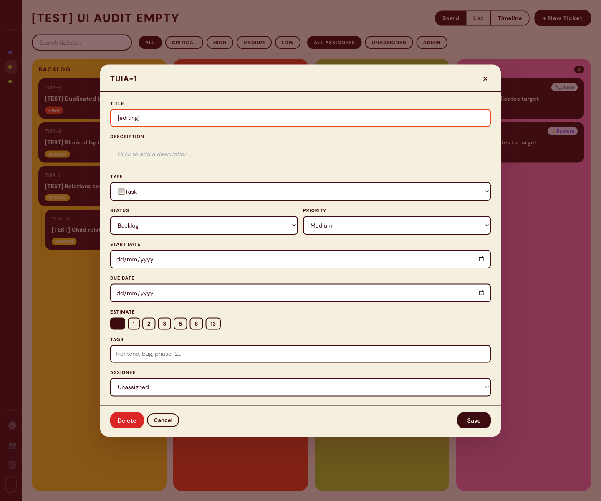
- **Problem:** Free-text fields have no length guidance or feedback.
- **Technical Solution:** Add `maxLength` and live counters to text inputs in `TicketModal`.

### [ISSUE-25] Hardcoded Magic Colors
- **Severity:** Medium | **Category:** Consistency, AI-feel
- **Screenshot:** All
- **Problem:** Scatter of cool-gray Tailwind hex codes that break warm theme cohesion.
- **Technical Solution:** Define semantic gray tokens in `index.css` (e.g., `--color-muted-on-dark`) and replace all hexes.

---

## 3. Priority Matrix (Impact × Effort)

| Rank | Issue ID | Title | Impact | Effort | Fix Type |
|------|----------|-------|--------|--------|----------|
| 1 | [ISSUE-03] | Vietnamese Mixed Language | Critical | Low | Logic |
| 2 | [ISSUE-01] | Invisible Estimate Badge | Critical | Low | Style |
| 3 | [ISSUE-02] | Low-Contrast Card Text | Critical | Low | Style |
| 4 | [ISSUE-06] | White Search Input | High | Low | Style |
| 5 | [ISSUE-14] | Overwhelming Column Colors | High | Low | Style |
| 6 | [ISSUE-04] | Hover Opacity Glitch | High | Low | Style |
| 7 | [ISSUE-11] | Typographic Hierarchy | High | Med | Assets/Style |
| 8 | [ISSUE-07] | Styled Confirm Dialogs | High | Med | Component |
| 9 | [ISSUE-09] | Lucide Icon Migration | High | Med | Component |
| 10 | [ISSUE-05] | Sidebar Icon Discovery | High | Med | Navigation |

---

## 4. Implementation Roadmap

### Wave 1: Quick Wins & Polish (~1 Day)
*Focus: Instant visual credibility and accessibility.*
- **Files:** `index.css`, `TicketCard.module.css`, `FilterBar.module.css`, `TicketModal.tsx`
- **Issues:** 01, 02, 03, 04, 06, 11, 14, 20, 25

### Wave 2: Component Hardening (~2 Days)
*Focus: Structural consistency and interactive reliability.*
- **Files:** `ProjectSidebar.tsx`, `RelationsSection.tsx`, `Column.tsx`, `TicketModal.tsx`
- **Issues:** 05, 08, 09, 12, 13, 15, 17, 18, 19, 22

### Wave 3: Feature Architecture (~1 Week)
*Focus: Mobile layout, stateful transitions, and full accessibility.*
- **Files:** `Board.tsx`, `Board.module.css`, `ProjectSidebar.tsx`, `App.tsx`
- **Issues:** 07, 10, 16, 21, 23, 24

---

## 5. Design System Decisions

- **Color Palette:** Strictly use CSS variables defined in `index.css`. Neutral text must use warm grays (derived from maroon/beige) instead of blue-gray Tailwind defaults.
- **Typography:**
  - **Display:** `DM Serif Display` or similar for `h1`, headers, and column names.
  - **Body:** `DM Sans` for all utility text and inputs.
- **Spacing:** standard 4px/8px modular grid. Cards use 16px padding.
- **Interactions:**
  - **Hover:** 3px upward lift + drop shadow. Opacity must remain 1.0.
  - **Active:** `cursor: grabbing` on hold.
- **Icons:** Standardize on **Lucide Icons** at 12px for badges and 20px for sidebar. No Unicode or Emoji for functional UI signals.

---

## 6. Assets Index

| Asset Path | Description |
|------------|-------------|
| [board-populated.png](./screenshots/board-populated.png) | Standard board view with multiple cards and columns. |
| [ticket-card-hover.png](./screenshots/ticket-card-hover.png) | Close-up of card highlighting text contrast and hover glitches. |
| [board-layout-redesign.excalidraw](./designs/board-layout-redesign.excalidraw) | Wireframe for sidebar icon and column layout update. |
| [board-layout-redesign.png](./designs/board-layout-redesign.png) | Rendered PNG of board-layout-redesign. |
| [interaction-states.excalidraw](./designs/interaction-states.excalidraw) | Design for drag handles and drop-zone placeholders. |
| [interaction-states.png](./designs/interaction-states.png) | Rendered PNG of interaction-states. |
| [ticket-card-redesign.excalidraw](./designs/ticket-card-redesign.excalidraw) | Wireframe for ticket card before/after comparison. |
| [ticket-card-redesign.png](./designs/ticket-card-redesign.png) | Rendered PNG of ticket-card-redesign. |
| [ticket-modal-redesign.excalidraw](./designs/ticket-modal-redesign.excalidraw) | Wireframe for ticket modal layout proportions. |
| [ticket-modal-redesign.png](./designs/ticket-modal-redesign.png) | Rendered PNG of ticket-modal-redesign. |
| [empty-states-redesign.excalidraw](./designs/empty-states-redesign.excalidraw) | Wireframe for empty state designs. |
| [empty-states-redesign.png](./designs/empty-states-redesign.png) | Rendered PNG of empty-states-redesign. |
| [mobile-layout-redesign.excalidraw](./designs/mobile-layout-redesign.excalidraw) | Wireframe for mobile layout at 375px breakpoint. |
| [mobile-layout-redesign.png](./designs/mobile-layout-redesign.png) | Rendered PNG of mobile-layout-redesign. |
| ... | *See `/docs/ui-audit/` for full directory.* |
