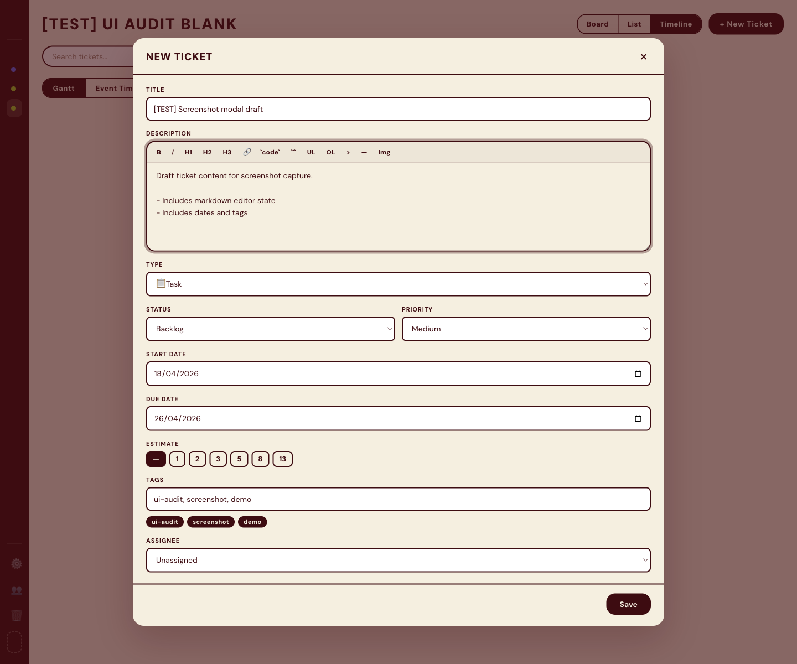
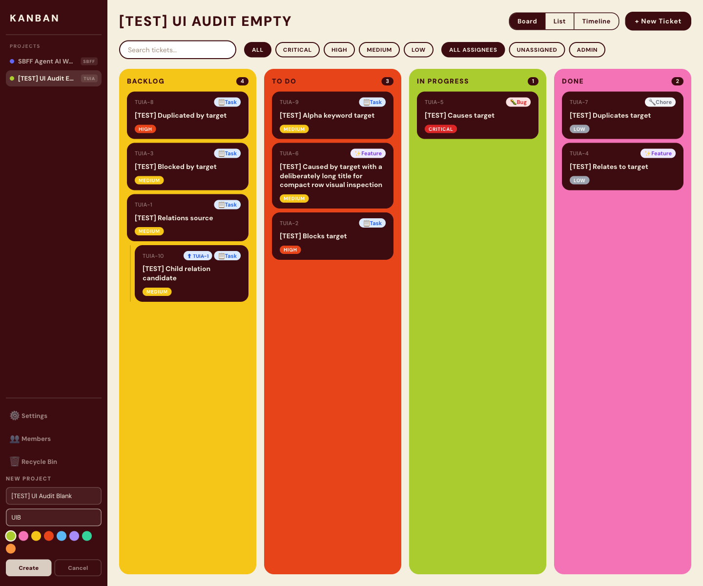
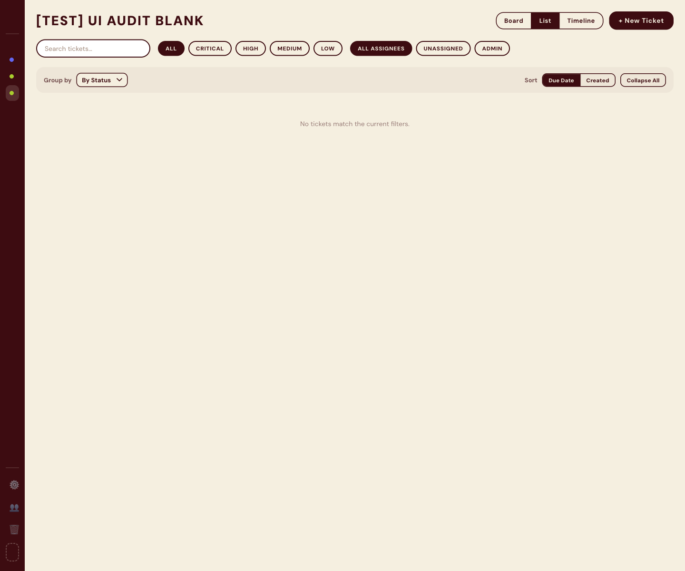
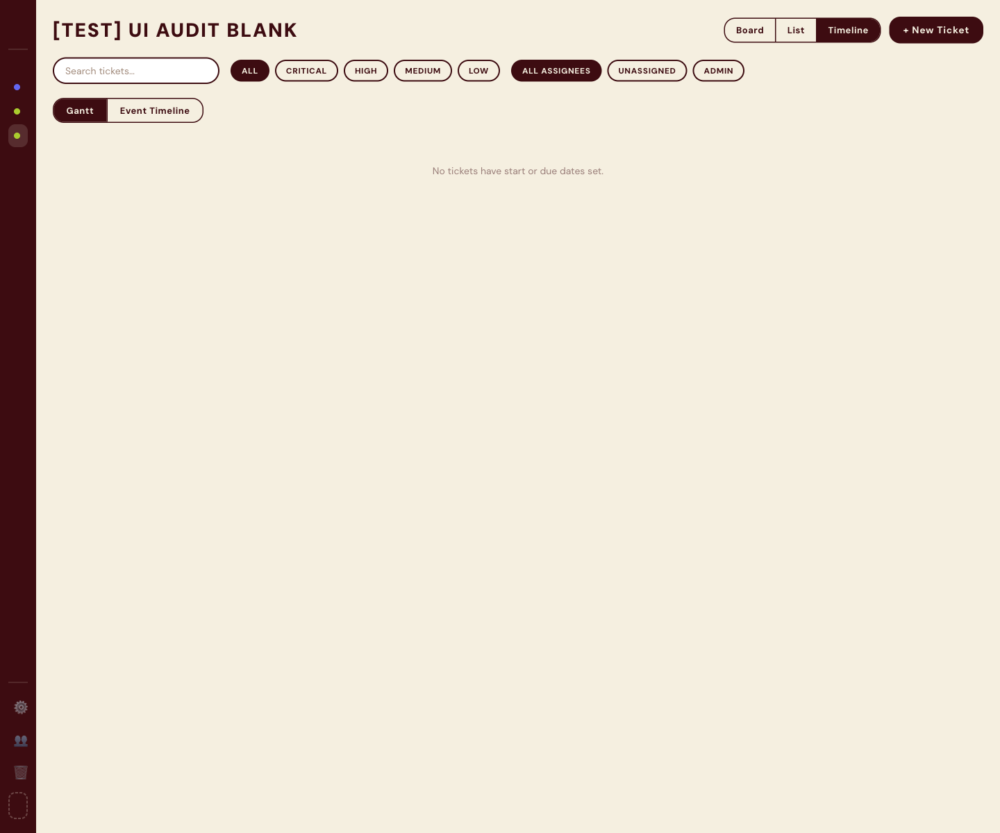
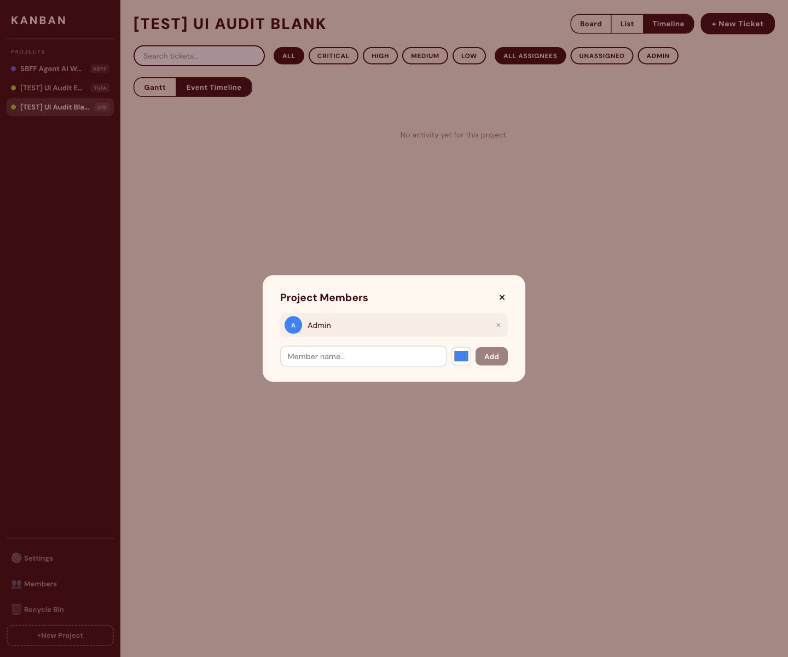
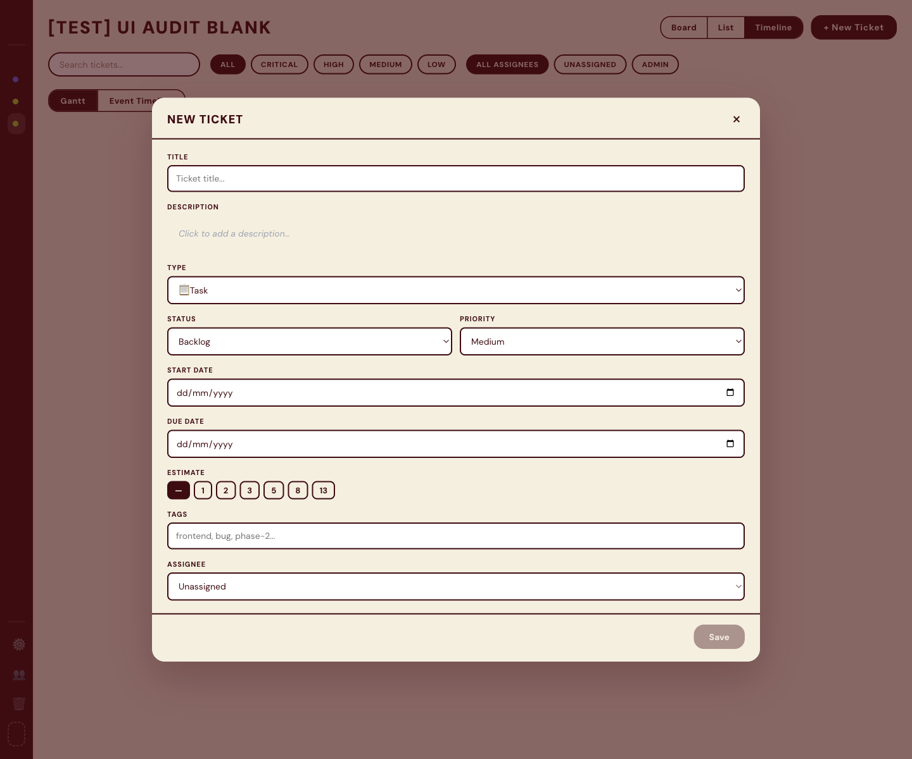

I now have a thorough read of the codebase. Let me produce the full audit.

---

# UI/UX Audit — Kanban Board MCP

> Audited against: screenshots (22 files) + source code (Board, Column, TicketCard, TicketModal, FilterBar, ProjectSidebar, RelationsSection, SettingsPanel, index.css)
> 
> Lenses: User Friendliness · Visual Consistency · Professionalism · AI-Generated Feel

---

## Issues

---

### [ISSUE-01] Estimate Badge Is Invisible on the Ticket Card

**Screen(s):** `board-populated.png`, `ticket-card-hover.png`


**Category:** Professionalism
**Severity:** Critical

**What the problem is:**
`TicketCard.module.css` defines `.estimateBadge` with `background: var(--color-dark)` and `color: var(--color-bg)`. The card itself also has `background: var(--color-dark)`. The badge is rendered on the same background color as itself — effectively invisible to the user.

**Where exactly:**
Bottom of every TicketCard that has `ticket.estimate` set. The "SP: N" estimate badge renders as dark-on-dark.

**Why it matters:**
Story points / effort estimates are a primary planning signal. If they can't be read, they might as well not exist. A developer viewing the board during planning loses a key data point.

**Recommended fix:**
Change `.estimateBadge` background to a clearly contrasting token. Suggested: a subtle translucent overlay of `--color-bg` (beige) with the dark text:
```css
.estimateBadge {
  background: rgba(245, 239, 224, 0.15);
  color: var(--color-bg);
  border: 1px solid rgba(245, 239, 224, 0.35);
  font-size: 11px;
  font-weight: 700;
  border-radius: 999px;
  padding: 2px 8px;
}
```
Or simply invert to beige-background + dark text, matching the `.tag` style.

---

### [ISSUE-02] Low-Contrast Gray Text on Dark Cards

**Screen(s):** `board-populated.png`, `ticket-card-hover.png`


**Category:** Professionalism, UX
**Severity:** Critical

**What the problem is:**
Three classes on TicketCard use `color: #6B7280` (Tailwind Gray-500, WCAG contrast ratio ~2.2:1 on `#3D0C11`):
- `.dueDate` — date the ticket is due
- `.subTasksProgress` — acceptance criteria count
- `.cardId` — ticket identifier (additionally dimmed with `opacity: 0.5`)

WCAG AA minimum is 4.5:1 for normal text. All three fail badly.

**Where exactly:**
Bottom area and top-left of every ticket card. The card ID, due date, and subtask progress fraction are unreadable in any non-ideal viewing condition.

**Why it matters:**
Due dates and ticket IDs are navigation anchors. Users scan for them under time pressure. Illegibility erodes trust in the product.

**Recommended fix:**
Use high-contrast equivalents on the dark card surface:
```css
/* On dark card (#3D0C11 bg) */
.dueDate { color: rgba(245, 239, 224, 0.65); }
.subTasksProgress { color: rgba(245, 239, 224, 0.65); }
.cardId { opacity: 1; color: rgba(245, 239, 224, 0.5); font-size: 11px; }
```
`rgba(245, 239, 224, 0.65)` on `#3D0C11` yields ~4.8:1 — passes AA.

---

### [ISSUE-03] Mixed Language — "Không làm" in English UI

**Screen(s):** `ticket-detail-open.png`, `ticket-detail-editing.png`, `ticket-create-filled.png`



**Category:** Professionalism
**Severity:** Critical

**What the problem is:**
In `TicketModal.tsx`:
```ts
const STATUS_LABELS: Record<Status, string> = {
  ...
  wont_do: 'Không làm',  // Vietnamese for "Won't do"
};
```
Every other label in the system is English. "Không làm" appears in the status picker, activity log, and any status display — jarring for any non-Vietnamese user and signaling an unfinished localization pass that was never cleaned up.

**Where exactly:**
Status dropdown in the ticket modal, status badges in list view, any activity log entry referencing the `wont_do` transition.

**Why it matters:**
It looks like a developer artifact left in production — one of the clearest signals that a product is not polished. Anyone who demos or shares the app notices it immediately.

**Recommended fix:**
In `TicketModal.tsx`, change to `wont_do: "Won't Do"`. Optionally, centralize `STATUS_LABELS` into a shared `constants.ts` to prevent future divergence.

---

### [ISSUE-04] Hover State Makes Cards More Transparent (Counterintuitive)

**Screen(s):** `ticket-card-hover.png`

**Category:** UX, Professionalism
**Severity:** High

**What the problem is:**
`TicketCard.module.css` defines:
```css
.card:hover {
  transform: translateY(-2px);
  opacity: 0.92;
}
```
Reducing opacity on hover makes the card appear to fade away — the opposite of the "I'm selecting this" feedback users expect. Standard micro-interaction convention is to intensify (higher contrast, slight lift or shadow) on hover, not to dim.

**Where exactly:**
Every ticket card on the board when the user moves their mouse over it.

**Why it matters:**
Hover state is a fundamental affordance signal. Dimming teaches the user "hovering means disengaging" — the wrong mental model. It's especially confusing because the upward lift (`translateY(-2px)`) correctly signals "active" while the opacity cancels that signal.

**Recommended fix:**
Remove the opacity change. Instead, add a subtle box-shadow to reinforce the lift:
```css
.card:hover {
  transform: translateY(-3px);
  box-shadow: 0 8px 20px rgba(61, 12, 17, 0.35);
}
```

---

### [ISSUE-05] Collapsed Sidebar Has No Icons — Zero Affordance

**Screen(s):** `board-populated.png`, `board-empty.png`


**Category:** UX, Professionalism
**Severity:** High

**What the problem is:**
The sidebar collapses to 52px width. The logo text `KANBAN` is hidden (`opacity: 0`). Only colored project dots are visible. The "Members", "Settings", "Recycle Bin" actions are completely invisible at 52px — they exist only as text labels revealed on hover. There are no icons anywhere in the sidebar.

**Where exactly:**
The left sidebar in all non-hover board views. Bottom action buttons (Members, Settings, Recycle Bin) are invisible when the sidebar is in its default collapsed state.

**Why it matters:**
A user who hasn't hovered the sidebar yet has no idea any of those actions exist. The colored project dots give partial context, but utility actions are completely hidden. This is a discoverability failure — features users never find might as well not exist.

**Recommended fix:**
Add SVG icons to every sidebar item. Show the icon always; show the text only on expand. Use 20×20 icons from a consistent library (e.g. Phosphor Icons or Lucide). Tooltip (`title` attribute or floating tooltip) on hover of collapsed items for accessibility.

```tsx
// Example: ProjectItem collapsed state
<span className={styles.icon}><FolderIcon size={18} /></span>
<span className={styles.projectName}>{project.name}</span>
```

---

### [ISSUE-06] Search Input Uses `background: white` — Breaks Beige Theme

**Screen(s):** `board-search-filter.png`, `board-populated.png`


**Category:** Consistency
**Severity:** High

**What the problem is:**
`FilterBar.module.css` sets:
```css
.searchInput {
  background: white;
}
```
The entire app uses `--color-bg: #F5EFE0` (warm vintage beige) as its surface color. A pure-white search input creates a jarring visual intrusion — the one white element in a warm-toned design system.

**Where exactly:**
The search box in the FilterBar, top of the main board area.

**Why it matters:**
Color consistency is the first thing a trained eye notices. White-on-beige reads as a mistake, not a deliberate choice. It undermines the carefully curated warmth of the rest of the design.

**Recommended fix:**
```css
.searchInput {
  background: var(--color-bg);
}
```

---

### [ISSUE-07] Native `window.confirm()` for Destructive Project Delete

**Screen(s):** `ticket-delete-confirmation.png`, `project-create-form-filled.png`


**Category:** Professionalism, Consistency
**Severity:** High

**What the problem is:**
In `ProjectSidebar.tsx`:
```ts
if (window.confirm('Delete this project? All its tickets will be lost.')) {
```
The native browser confirm dialog is OS-rendered, unstyled, blocking, and completely disconnected from the design system. It looks like a developer shortcut that made it to production.

**Where exactly:**
Triggered when clicking the delete button on a project item in the sidebar.

**Why it matters:**
Confirmation dialogs for irreversible operations must be styled and integrated. The OS-native modal breaks immersion, looks like a phishing prompt on some browsers, and is inaccessible (no focus ring, no design language consistency).

**Recommended fix:**
Create a lightweight `ConfirmDialog` component matching the app's modal aesthetic (`TicketModal` panel pattern). A single reusable component:
```tsx
<ConfirmDialog
  title="Delete project?"
  message="All its tickets will be permanently lost."
  confirmLabel="Delete"
  danger
  onConfirm={() => onDeleteProject(id)}
  onCancel={() => {}}
/>
```
Same animation, same border-radius, same color tokens as `TicketModal`.

---

### [ISSUE-08] Drag-Drop Has No Explicit Drag Handle Affordance

**Screen(s):** `board-dragging.png`

**Category:** UX
**Severity:** High

**What the problem is:**
Cards use the entire surface as the drag zone (`PointerSensor` with `distance: 8` activation). There is no visual drag handle (grip icon). The only affordance is the cursor change — which is invisible until you attempt to drag. New users have no reason to attempt dragging to move tickets.

**Where exactly:**
All ticket cards on the board view.

**Why it matters:**
Drag-and-drop is the primary action for moving tickets. If users don't discover it, they may believe the board is static. This is especially problematic for users coming from click-based tools (Jira's dropdown status selector, for example).

**Recommended fix:**
Add a subtle drag handle indicator — either a persistent `⠿` or `⋮⋮` icon at the card's top-right, or make the cursor `grab` by adding `cursor: grab` to `.card`. On touch devices, a visible handle is even more critical.

```css
.card {
  cursor: grab;
}
.card:active {
  cursor: grabbing;
}
```
Plus a small `⠿` icon in top-right with `opacity: 0; .card:hover .dragHandle { opacity: 0.4 }`.

---

### [ISSUE-09] Pervasive Emoji Icons Feel Prototypey

**Screen(s):** All screens with tickets — `board-populated.png`, `ticket-card-hover.png`, `ticket-detail-open.png`


**Category:** AI-feel, Professionalism
**Severity:** High

**What the problem is:**
Ticket types and states are communicated entirely through emoji:
- Bug: 🐛, Feature: ✨, Task: 📋, Chore: 🔧
- Blocked: 🔒, Overdue: ⚠️, Due date: 📅
- Subtask progress: ◻ / ✓ (Unicode characters, not SVG)

Emoji rendering varies dramatically across OS, browser, and display density. On some systems 🐛 renders at a completely different visual weight than ✨. Unicode symbols ◻ render differently on macOS vs Windows vs Linux. This is one of the clearest "AI-generated prototype" signals — emoji are the easiest placeholder icon system.

**Where exactly:**
TicketCard header (type badge), card body (blocked, overdue, due date), ticket modal everywhere.

**Why it matters:**
Emoji are not design-system icons. They communicate inconsistently, cannot be styled (color, stroke weight), and make the app look unfinished. Professional tools (Linear, Jira, Notion) all use consistent SVG icon systems.

**Recommended fix:**
Adopt a single icon library (Lucide Icons or Phosphor — both have React packages). Replace each emoji with a deterministic SVG icon:
- 🐛 → `<Bug size={12} />`, ✨ → `<Sparkles size={12} />`, 📋 → `<ClipboardList />`, 🔧 → `<Wrench />`
- 🔒 → `<Lock />`, ⚠️ → `<AlertTriangle />`, 📅 → `<Calendar />`

SVG icons can take `color: currentColor` and scale precisely with `font-size`.

---

### [ISSUE-10] No Responsive Layout for Board Columns

**Screen(s):** `board-mobile-narrow.png`

**Category:** UX, Professionalism
**Severity:** High

**What the problem is:**
`Board.module.css` defines columns as:
```css
.columns {
  display: grid;
  grid-template-columns: repeat(4, 1fr);
}
```
No media queries or responsive adjustments exist. On mobile (375px), this forces four equal columns into ~80px each — cards become unreadable. The only solution is horizontal scroll, which the QC audit confirmed.

**Where exactly:**
The 4-column board layout on any screen narrower than ~900px.

**Why it matters:**
Even if the app is primarily desktop-targeted, mobile responsiveness is a baseline quality expectation in 2026. Horizontal scroll on a 375px screen is a first-impression failure that signals low craft.

**Recommended fix:**
```css
.columns {
  display: grid;
  grid-template-columns: repeat(4, minmax(200px, 1fr));
  overflow-x: auto; /* or */
}

@media (max-width: 768px) {
  .columns {
    grid-template-columns: 1fr;
  }
}
```
On mobile, stack columns vertically. Collapsed by default with a "show cards" toggle, or filter to one column at a time.

---

### [ISSUE-11] `--font-display` and `--font-body` Are Identical — Zero Typographic Hierarchy

**Screen(s):** All screens
**Category:** AI-feel, Professionalism
**Severity:** Medium

**What the problem is:**
`index.css` defines:
```css
--font-display: 'DM Sans', system-ui, sans-serif;
--font-body:    'DM Sans', system-ui, sans-serif;
```
The design system declares intent to differentiate display/body fonts, but both point to the same typeface. DM Sans is a clean geometric sans, but with zero typographic contrast, every text element from board titles to body copy to labels uses the same visual DNA.

**Where exactly:**
Board title, column headers, modal headers, all body copy — everything is rendered in DM Sans.

**Why it matters:**
Typographic hierarchy is the most powerful tool for communicating importance. When everything is the same font, weight differentiation alone must carry all hierarchy burden — and with DM Sans' limited optical range, the result reads as visually flat. This is a canonical AI-generated UI trait: same font, only weight varies.

**Recommended fix:**
Assign a distinctive display face for headers and major UI moments:
- Option A (editorial, fits the maroon-beige palette): `'Playfair Display'` or `'Libre Baskerville'` for display
- Option B (modern, high-contrast): `'Space Grotesk'` display + `'DM Sans'` body (avoid `Space Grotesk` if already used elsewhere)
- Option C (keeps DM Sans as body, adds a serif flair): `'DM Serif Display'` for headers — pairs perfectly since it's from the same design family

Apply to: board `h1.title`, column labels, modal header titles.

---

### [ISSUE-12] Status Color Tokens in RelationsSection Are Tailwind Palette Pulls

**Screen(s):** `ticket-relations-add-menu.png`, `ticket-detail-open.png`


**Category:** Consistency, AI-feel
**Severity:** Medium

**What the problem is:**
`RelationsSection.tsx` defines status chip colors as:
```ts
const STATUS_COLORS = {
  backlog:      { bg: '#FEF9C3', color: '#854D0E' },
  todo:         { bg: '#FED7AA', color: '#9A3412' },
  'in-progress':{ bg: '#D9F99D', color: '#3F6212' },
  done:         { bg: '#FCE7F3', color: '#9D174D' },
  wont_do:      { bg: '#F3F4F6', color: '#6B7280' },
};
```
Every single value (`#FEF9C3`, `#FED7AA`, `#D9F99D`, `#FCE7F3`) is a recognizable Tailwind CSS color (`yellow-100`, `orange-200`, `lime-200`, `pink-100`). They bear no relationship to the app's brand palette (`--color-yellow: #F5C518`, `--color-orange: #E8441A`, etc.).

**Where exactly:**
Status chips in the Relations section of the ticket detail modal.

**Why it matters:**
The brand palette is one of this app's strongest design assets (warm beige + deep maroon + vivid accents). Using off-brand Tailwind pastels in a core feature undermines the cohesion. Experienced designers will notice the palette inconsistency immediately.

**Recommended fix:**
Derive status colors from the existing design system variables:
```ts
const STATUS_COLORS = {
  backlog:      { bg: 'rgba(245, 197, 24, 0.18)',  color: '#7a6200' },
  todo:         { bg: 'rgba(232, 68, 26, 0.15)',   color: '#8c2800' },
  'in-progress':{ bg: 'rgba(170, 204, 46, 0.2)',   color: '#4a6800' },
  done:         { bg: 'rgba(244, 114, 182, 0.18)', color: '#831843' },
  wont_do:      { bg: 'rgba(61, 12, 17, 0.08)',    color: '#6B7280' },
};
```

---

### [ISSUE-13] Duplicate Priority Color Definitions Between Components

**Screen(s):** `board-populated.png`, `ticket-detail-open.png`


**Category:** Consistency
**Severity:** Medium

**What the problem is:**
`PRIORITY_COLORS` is defined independently in both `TicketCard.tsx` (as `Record<Priority, string>` — just a background hex) and `TicketModal.tsx` (as `Record<Priority, { bg: string; color: string }>`). They use different data shapes and could drift out of sync.

**Where exactly:**
Priority badge on TicketCard vs priority selector in TicketModal.

**Why it matters:**
When badge color on the card doesn't match the priority indicator in the modal, users feel disoriented even if they can't articulate why. Two sources of truth for the same concept is a maintenance risk and a consistency risk.

**Recommended fix:**
Extract to a shared `constants/priority.ts`:
```ts
export const PRIORITY_CONFIG: Record<Priority, { bg: string; color: string; label: string }> = {
  critical: { bg: '#DC2626', color: '#fff',                   label: 'Critical' },
  high:     { bg: '#E8441A', color: '#fff',                   label: 'High'     },
  medium:   { bg: '#F5C518', color: 'var(--color-dark)',      label: 'Medium'   },
  low:      { bg: '#9CA3AF', color: 'var(--color-dark)',      label: 'Low'      },
};
```
Import in both components.

---

### [ISSUE-14] Column Accent Colors Overwhelm Card Content at High Density

**Screen(s):** `board-populated.png`

**Category:** Professionalism, UX
**Severity:** Medium

**What the problem is:**
Column backgrounds are full-saturation accent colors: yellow (`#F5C518`), orange-red (`#E8441A`), lime (`#AACC2E`), pink (`#F472B6`). When a column contains 8–12 dark cards, the bright background color bleeds around the cards aggressively. The lime and yellow columns in particular create eyestrain — the combination of strong color + many dark rectangles creates a visual vibration effect.

**Where exactly:**
Primarily the "In Progress" (lime green) and "Backlog" (yellow) columns under high ticket load.

**Why it matters:**
A Kanban board's primary job is to communicate workload at a glance. When columns are hard to visually parse due to vibrating color contrast, the board becomes cognitively expensive. High-performing boards (Linear, GitHub Projects) use muted tints, not saturated fills.

**Recommended fix:**
Reduce column background opacity significantly:
```tsx
// In Column.tsx style prop
style={{
  backgroundColor: `${column.accentColor}26`, // ~15% opacity via hex alpha
  borderTop: `3px solid ${column.accentColor}`, // keep color identity at top
}}
```
This preserves visual column identity while dramatically improving readability of card contents.

---

### [ISSUE-15] FilterBar Two-Row Layout Is Visually Disorganized

**Screen(s):** `board-search-filter.png`, `board-populated.png`


**Category:** UX, Professionalism
**Severity:** Medium

**What the problem is:**
`FilterBar` renders search + priority chips on one flex row, and if members exist, adds another full row of assignee chips below — all in the same `flex-wrap: wrap` container. With 4+ members, the filter bar grows into a multi-line cluster with no visual grouping, no labels for each row, and no clear hierarchy between "priority" and "assignee" filters.

**Where exactly:**
The filter area above the columns — between the top bar (title + view switch) and the columns.

**Why it matters:**
Filters are a power user's tool. Disorganized filter UIs create hesitation ("which filter is active?", "what am I filtering by?"). The lack of visual separation between filter categories increases cognitive load.

**Recommended fix:**
Introduce labeled filter groups with dividers:
```tsx
<div className={styles.filterBar}>
  <SearchInput ... />
  <FilterGroup label="Priority" chips={PRIORITY_CHIPS} ... />
  {members.length > 0 && <FilterGroup label="Assignee" chips={memberChips} ... />}
</div>
```
Each group has a small 10px uppercase label and wraps independently. Active filters show as filled chips; a "Clear filters" link appears only when non-default filters are active.

---

### [ISSUE-16] Empty Board State Provides No Onboarding Signal

**Screen(s):** `board-empty.png`, `list-empty.png`, `timeline-empty.png`



**Category:** UX, Professionalism
**Severity:** Medium

**What the problem is:**
When no tickets exist, the board renders four empty colored columns with no copy, no illustration, no call-to-action. The only path to creating a ticket is the "+ New Ticket" button in the top bar — which a new user might not notice. The empty columns could easily be mistaken for a loading state.

**Where exactly:**
All four columns when a project has zero tickets. Also `list-empty.png` and `timeline-empty.png` which reportedly show empty states.

**Why it matters:**
First-time onboarding is the highest-leverage UX moment. An empty Kanban board with zero guidance creates a "blank canvas anxiety" effect — users don't know where to start and are more likely to abandon the session.

**Recommended fix:**
In the Backlog column (or the first column), when `tickets.length === 0` for the whole board, render an empty-state callout:
```tsx
{tickets.length === 0 && (
  <div className={styles.emptyState}>
    <span className={styles.emptyStateIcon}><LayoutGrid size={28} /></span>
    <p className={styles.emptyStateTitle}>No tickets yet</p>
    <p className={styles.emptyStateBody}>Create your first ticket to start tracking work.</p>
    <button onClick={onNewTicket} className={styles.emptyStateCTA}>+ Create ticket</button>
  </div>
)}
```

---

### [ISSUE-17] Close/Remove Button Characters Are Inconsistent (`×` vs `✕`)

**Screen(s):** `ticket-relations-add-menu.png`, `ticket-detail-open.png`


**Category:** Consistency, Professionalism
**Severity:** Low

**What the problem is:**
`RelationsSection.tsx` uses two different Unicode close characters:
- Remove relation button: `×` (U+00D7, MULTIPLICATION SIGN)
- Close form button: `✕` (U+2715, BALLOT X)

These render at different sizes and weights on different platforms. The inconsistency is a small but telling detail.

**Where exactly:**
Relations section in the ticket detail modal — row remove button vs "close add form" button.

**Why it matters:**
Pixel-level details like this distinguish polished interfaces from prototypes. The inconsistency signals either rushed implementation or no design review pass.

**Recommended fix:**
Standardize on one semantic approach. Best practice: use an SVG icon (`<X size={14} />` from Lucide) rather than Unicode for all close/dismiss/remove actions. This is consistent, accessible (no ambiguous aria-label interpretation), and renders identically everywhere.

---

### [ISSUE-18] Column Drop Zone Feedback Is Ambiguous

**Screen(s):** `board-dragging.png`

**Category:** UX
**Severity:** Medium

**What the problem is:**
`Column.tsx` uses:
```tsx
style={{
  filter: isOver ? 'brightness(0.88)' : undefined,
  outline: isOver ? '2px solid rgba(0,0,0,0.2)' : undefined,
}}
```
On the lime green column (`#AACC2E`), `brightness(0.88)` simply makes it a slightly darker green. The `outline` of 20% black is barely visible. There is no placeholder card, no dashed insertion indicator, no color shift to the brand's highlight color.

**Where exactly:**
Column background and border during an active drag-over event.

**Why it matters:**
Drop zone affordance is critical for drag-and-drop confidence. Users need an unambiguous signal that "this is where the card will land." Ambiguous feedback leads to mis-drops and confusion, especially on brightly colored columns where brightness shifts are hard to perceive.

**Recommended fix:**
Replace the brightness filter with a border-color highlight and add a ghost drop slot:
```tsx
style={{
  borderTop: isOver
    ? `4px solid var(--color-dark)`
    : `4px solid transparent`,
  transition: 'border-top-color 0.1s ease',
}}
```
Additionally, render a `<div className={styles.dropPlaceholder} />` (a bordered ghost slot) at the insertion point in the column's card list.

---

### [ISSUE-19] Sidebar Collapse Has No Tooltip — Utility Items Are Undiscoverable

**Screen(s):** `board-populated.png`, `members-panel.png`, `settings-panel.png`



**Category:** UX
**Severity:** High

**What the problem is:**
When the sidebar is in its narrow state (52px), the navigation items for "Members", "Settings", and "Recycle Bin" are completely invisible — they exist only as text labels that appear on hover. Users browsing the app without hovering the sidebar have no reason to know these panels exist. The colored project dots hint at projects, but utility actions have zero affordance.

**Where exactly:**
Bottom section of the sidebar in all collapsed-state views.

**Why it matters:**
Feature discoverability is a first-order UX problem. Features users can't find are features that don't exist. "Members" and "Settings" are important for first-run setup — yet they're invisible unless the user accidentally hovers a 52px strip.

**Recommended fix:**
Add persistent icon buttons that are always visible at 52px. Each item needs:
1. An SVG icon (`<Users />`, `<Settings />`, `<Trash2 />`) pinned to the sidebar
2. A `title` tooltip for accessibility
3. The text label appearing on expand

The sidebar should never be empty of visual content in collapsed state.

---

### [ISSUE-20] Board Title Typography Is Too Aggressive for a Utility Header

**Screen(s):** `board-populated.png`, `board-empty.png`


**Category:** AI-feel, Professionalism
**Severity:** Medium

**What the problem is:**
```css
.title {
  font-size: 28px;
  font-weight: 900;
  letter-spacing: 0.08em;
  text-transform: uppercase;
}
```
The project name ("MY PROJECT", "KANBAN BOARD") renders at 28px/900 weight/uppercase/0.08em tracking. This is maximum-aggression typographic treatment applied to what is fundamentally a utility label. When the project name is long, it wraps aggressively. The styling choice reads as "design generated without consideration of actual content."

**Where exactly:**
Top-left of the board, adjacent to the view switcher and "New Ticket" button.

**Why it matters:**
Typographic weight is a trust signal. Titles screaming at maximum weight/size/tracking for a personal productivity tool feel miscalibrated. It's the visual equivalent of using ALL CAPS in a message — assertive past the point of usefulness. Specifically flagged by QC as a "wraps aggressively" issue on mobile.

**Recommended fix:**
Reduce to a more considered treatment:
```css
.title {
  font-size: 20px;
  font-weight: 800;
  letter-spacing: 0.04em; /* halved */
  text-transform: none; /* show natural casing */
  white-space: nowrap;
  overflow: hidden;
  text-overflow: ellipsis;
  max-width: 300px;
}
```
If a display font is introduced ([ISSUE-11]), the title is the right place to use it.

---

### [ISSUE-21] No Keyboard Navigation / Focus Trap in Modals

**Screen(s):** `ticket-detail-open.png`, `ticket-create-empty.png`, `settings-panel.png`



**Category:** UX, Professionalism
**Severity:** High

**What the problem is:**
`TicketModal` and `SettingsPanel` render overlays with `role="dialog" aria-modal="true"`, but there's no focus trap implementation. When the modal opens, focus is not moved inside it. Tab key navigates the background content behind the overlay. Pressing Escape to close isn't confirmed in the code.

**Where exactly:**
All modal/overlay components.

**Why it matters:**
Focus trapping is a WCAG 2.4.3 requirement for modal dialogs. Beyond accessibility compliance, it's a basic UX expectation: pressing Escape should close a modal, and Tab should cycle through only the modal's controls. Missing this makes the app feel unfinished to keyboard users.

**Recommended fix:**
Use the `focus-trap-react` package or implement a native `<dialog>` element (which has built-in focus trapping):
```tsx
// Option: use native dialog
<dialog ref={dialogRef} className={styles.panel} onClose={onClose}>
  ...
</dialog>
```
Or add `focus-trap-react` wrapping the panel content, and add `onKeyDown` handler for Escape.

---

### [ISSUE-22] FilterBar Shows Active Filter State Inconsistently for Member vs Priority

**Screen(s):** `board-search-filter.png`

**Category:** Consistency, UX
**Severity:** Medium

**What the problem is:**
Active priority chips use `background: var(--color-dark); color: var(--color-bg)` (dark fill). Active member chips use `borderColor: m.color; background: m.color; color: '#fff'` (member's avatar color). These are two different visual languages for the same concept of "this filter is active" — one dark-filled, one member-color-filled.

**Where exactly:**
FilterBar, when a priority and a member are both actively selected.

**Why it matters:**
Filter UI state is how users know what they're looking at. Inconsistent active-state styling means the user has to interpret two different visual affordances for the same cognitive concept. Small, but a polish detail that separates thoughtful products from assembled ones.

**Recommended fix:**
Standardize on one active state pattern across all filter chips. Suggestion: use the dark fill for priority chips and match the same dark fill for member chips but add a left-side color pip matching the member color:
```css
/* All active chips: dark fill */
.chipActive {
  background: var(--color-dark);
  color: var(--color-bg);
}
/* Member active chip: dark fill + member-color left border */
.chipActiveMember {
  background: var(--color-dark);
  color: var(--color-bg);
  border-left: 3px solid var(--member-color);
}
```

---

### [ISSUE-23] No Loading Skeletons — Loading State Is Invisible

**Screen(s):** All views on first load
**Category:** UX, Professionalism
**Severity:** Medium

**What the problem is:**
`App.tsx` has `ticketsLoading` and `projectsLoading` states but no visual loading skeleton is rendered. The board likely either shows a flash of empty columns or nothing until data arrives. No shimmer, no spinner, no placeholder cards.

**Where exactly:**
Initial page load, and when switching projects.

**Why it matters:**
An invisible loading state creates "did it freeze?" anxiety. Users don't know if data is coming or if something went wrong. The industry baseline is a content skeleton (pulsing placeholder shapes) that communicates "data is loading" while maintaining the layout's structure.

**Recommended fix:**
Render skeleton cards inside columns during `ticketsLoading`:
```tsx
{ticketsLoading ? (
  Array.from({ length: 3 }).map((_, i) => <SkeletonCard key={i} />)
) : (
  orderedTickets.map(ticket => <DraggableTicketCard ... />)
)}
```
`SkeletonCard` is a dark rounded rectangle with CSS `@keyframes pulse` animation.

---

### [ISSUE-24] "Won't Do" Reason Text Field Has No Character Limit Indicator

**Screen(s):** `ticket-detail-editing.png`, `ticket-create-filled.png`


**Category:** UX, Professionalism
**Severity:** Low

**What the problem is:**
Based on the modal's form structure (inferred from code), the `wontDoReason` field is a free-text input with no character counter, no validation indicator while typing, and no visual hint about length expectations. Long reasons would overflow or be silently truncated.

**Where exactly:**
"Won't Do" reason field in the ticket modal edit mode.

**Why it matters:**
Unbounded text fields in structured forms degrade data quality. Users enter one-word reasons ("nope") or entire paragraphs with no guidance. This affects the value of the data downstream.

**Recommended fix:**
Add a `maxLength={200}` attribute and a live character counter below the field. CSS: `text-align: right; font-size: 11px; color: #9CA3AF`.

---

### [ISSUE-25] Hardcoded Magic Color Values — No Neutral/Gray Design Token

**Screen(s):** All screens
**Category:** Consistency, AI-feel
**Severity:** Medium

**What the problem is:**
`#6B7280` (Tailwind Gray-500) appears at least 7 times across components: `TicketCard.module.css` (dueDate, subTasksProgress), `RelationsSection.module.css` (ticketId, typeBadge color), `RelationsSection.tsx` (wont_do status color), `ProjectSidebar.module.css` (potentially), etc. Similarly `#9CA3AF` (Tailwind Gray-400) appears in multiple places.

These are not defined anywhere in `index.css` as custom properties. They're copy-pasted Tailwind values with no semantic meaning in this design system.

**Where exactly:**
Scattered throughout 5+ component CSS files.

**Why it matters:**
Hard-coded values create drift — one component's "muted text" will subtly differ from another's "muted text." More importantly, it's the signature pattern of AI-generated code: plucked from training data without adaptation to the local design system.

**Recommended fix:**
Add semantic neutral tokens to `index.css`:
```css
:root {
  --color-muted:       #8a7060;    /* muted text on light (beige) bg — on-brand warm gray */
  --color-muted-on-dark: rgba(245, 239, 224, 0.55); /* muted text on dark bg */
  --color-border:      rgba(61, 12, 17, 0.12); /* subtle dividers */
  --color-border-strong: rgba(61, 12, 17, 0.3);
}
```
Note: replace `#6B7280` (cool gray, out-of-palette) with `#8a7060` (warm gray derived from the beige/maroon system).

---

## Priority Matrix — Top 10 Fixes by Impact vs Effort

| Rank | Issue | Effort | Impact | Why This Slot |
|------|-------|--------|--------|---------------|
| 1 | **[ISSUE-03]** Fix "Không làm" mixed language | XS (5 min) | Critical | One line of code, immediate professionalism impact. Ship today. |
| 2 | **[ISSUE-01]** Fix invisible estimate badge | XS (15 min) | Critical | One CSS rule change, unblocks a key planning signal. |
| 3 | **[ISSUE-02]** Fix low-contrast gray text on dark cards | S (30 min) | Critical | 3 CSS declarations. Directly affects legibility of dates, IDs, progress. |
| 4 | **[ISSUE-06]** Fix white search input background | XS (5 min) | High | One CSS value. Removes the most obvious theme inconsistency. |
| 5 | **[ISSUE-04]** Fix hover opacity reduction on cards | XS (5 min) | High | Remove one line, add box-shadow. Fixes a counter-intuitive UX signal. |
| 6 | **[ISSUE-07]** Replace `window.confirm()` with styled dialog | M (2h) | High | High craft signal. Native browser dialog is the most obvious "unfinished" marker. |
| 7 | **[ISSUE-09]** Replace emoji icons with SVG (at least for type badges) | M (3h) | High | Biggest "AI slop" signal. Even replacing just the 4 type badges dramatically raises perceived quality. |
| 8 | **[ISSUE-05+19]** Add icons to collapsed sidebar | M (3h) | High | Discoverability of Members/Settings is blocked without this. Also addresses the zero-affordance collapsed state. |
| 9 | **[ISSUE-14]** Reduce column saturation (opacity on accent bg) | S (1h) | High | Directly improves readability of populated board — which is the app's primary view. |
| 10 | **[ISSUE-11]** Introduce a display font | S (1h) | Medium | Single Google Fonts import + 2 CSS variable changes. Transforms the typography hierarchy and removes the strongest "AI-generated, same-font-everywhere" signal. |

---

**Triage note:** Issues 1–6 are mechanical fixes (< 1h combined). Issues 7–10 are design decisions requiring slightly more thought, but each has a clear implementation path. The remaining 15 issues are real but addressable in a single focused sprint.

> What's your top priority — the quick accessibility/contrast fixes, the branding polish (fonts, icons, colors), or the UX discoverability issues (sidebar, empty states, drag affordance)?
